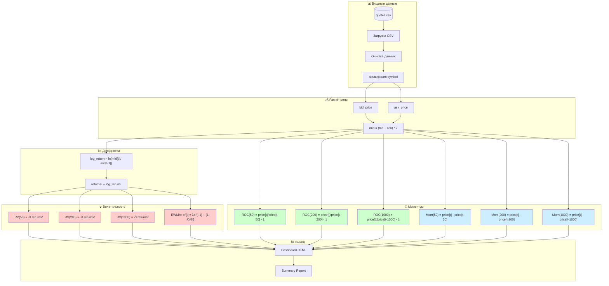
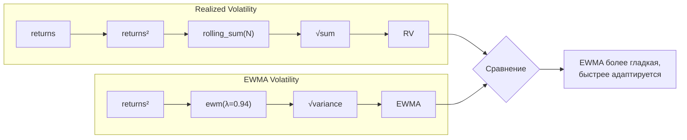
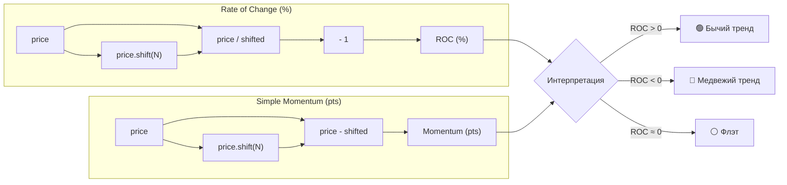
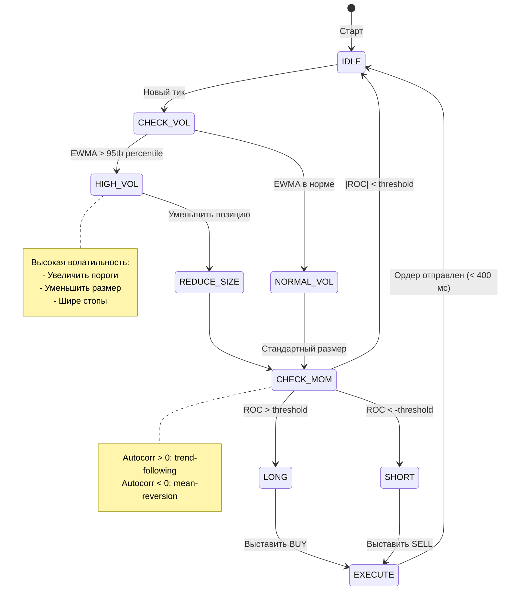

# Task 2: Volatility & Momentum Algorithm

## Описание

Алгоритм расчёта волатильности и моментума для фьючерсов в контексте торгового робота с латентностью **400 мс** от получения маркетдаты до выставления заявки.

## Контекст задачи

> Время работы робота от получения маркетдаты до выставления заявки составляет 400 мс. Для выставления заявок используется волатильность и моментум.
>
> Задача: Написать алгоритм, определяющий волатильность и моментум для выбранных фьючерсов. Вывести графики моментума и волатильности.

---

## Допущения и решения

| # | Вопрос | Допущение | Обоснование |
|---|--------|-----------|-------------|
| 1 | Источник данных? | CSV `quotes_202512260854-GOLD.csv` | Tick-by-tick котировки доступны в проекте |
| 2 | Какие фьючерсы? | GLDG26 (B3), GOLD-3.26 (MOEX) | Оба в данных, сравнение бирж показательно |
| 3 | Метод волатильности? | **Realized Vol + EWMA** | RV точнее для HFT, EWMA быстро адаптируется |
| 4 | Метод моментума? | **ROC + Simple Difference** | ROC нормализован (%), разница — в пунктах |
| 5 | Окна расчёта? | **50 / 200 / 1000 тиков** | Tick-based стабильнее при разной активности |
| 6 | Что значит 400 мс? | Латентность системы, НЕ ограничение на расчёт | Все индикаторы считаются мгновенно |
| 7 | Режим работы? | Batch (исторические данные) | Достаточно для демонстрации |
| 8 | Формат графиков? | Plotly HTML (интерактивные) | Удобно для анализа |

---

## Формулы индикаторов

### Волатильность

**1. Realized Volatility (RV)**

Стандартная мера для высокочастотных данных — сумма квадратов доходностей:

```
returns[t] = ln(price[t] / price[t-1])
RV = sqrt(sum(returns[t-n:t]²))
```

- Преимущество: не требует OHLC, работает с tick-by-tick
- Применение: оценка текущего уровня волатильности

**2. EWMA Volatility (Exponentially Weighted)**

Модель RiskMetrics с экспоненциальным затуханием:

```
σ²[t] = λ * σ²[t-1] + (1-λ) * return[t]²
EWMA_vol = sqrt(σ²[t])
```

- Параметр: λ = 0.94 (стандарт RiskMetrics)
- Преимущество: быстро адаптируется к изменениям
- Применение: фильтрация режимов волатильности для 400 мс робота

### Моментум

**1. Rate of Change (ROC)**

Процентное изменение цены за n периодов:

```
ROC = (price[t] / price[t-n]) - 1
```

- Преимущество: нормализован, сравним между инструментами
- Применение: определение направления тренда

**2. Simple Momentum**

Абсолютная разница цен:

```
Momentum = price[t] - price[t-n]
```

- Преимущество: интуитивно понятен, показывает движение в пунктах
- Применение: сигналы для входа/выхода

---

## Использование индикаторов в торговле

### Волатильность для 400 мс робота

1. **Режим высокой волатильности** (EWMA > 95-й персентиль):
   - Увеличить пороги входа/выхода
   - Уменьшить размер позиции
   - Использовать более широкие стопы

2. **Режим низкой волатильности** (EWMA < медианы):
   - Стандартные параметры
   - Можно увеличить частоту торговли

### Моментум для принятия решений

1. **Трендовые стратегии** (если autocorr(ROC) > 0):
   - Покупать при ROC > 0
   - Продавать при ROC < 0
   - Держать позицию пока тренд сохраняется

2. **Mean-reversion** (если autocorr(ROC) < 0):
   - Продавать при сильном ROC > 0
   - Покупать при сильном ROC < 0
   - Ожидать возврата к среднему

---

## Структура проекта

```
task2-volatility-momentum/
├── config.py                    # Параметры индикаторов
├── main.py                      # Точка входа
├── requirements.txt             # Зависимости
├── README.md                    # Документация
├── src/
│   ├── __init__.py
│   ├── data_loader.py           # Загрузка и подготовка данных
│   ├── volatility.py            # RV, EWMA волатильность
│   ├── momentum.py              # ROC, Simple Momentum
│   └── visualization.py         # Plotly графики
└── output/
    ├── indicators_b3.html       # Dashboard B3 (GLDG26)
    ├── indicators_moex.html     # Dashboard MOEX (GOLD-3.26)
    ├── comparison.html          # Сравнение B3 vs MOEX
    └── indicators_summary.md    # Текстовый отчёт
```

---

## Запуск

```bash
cd task2-volatility-momentum
python3 -m venv .venv
source .venv/bin/activate
pip install -r requirements.txt
python main.py
```

Результаты появятся в директории `output/`.

---

## Способы симуляции и валидации

### 1. Визуальная проверка

Откройте `output/indicators_b3.html` в браузере:
- Волатильность должна расти при резких движениях цены
- Моментум положителен при росте, отрицателен при падении

### 2. Корреляционный анализ

Сравните B3 vs MOEX в `output/comparison.html`:
- Волатильность должна коррелировать (один underlying — золото)
- Моментум может расходиться из-за разной ликвидности

### 3. Статистические проверки

В `output/indicators_summary.md` проверьте:
- **Autocorrelation ROC > 0** → momentum persistence, подходит trend-following
- **Autocorrelation ROC < 0** → mean-reversion доминирует
- **95th percentile волатильности** → порог для "высокой волатильности"

### 4. Сравнение методов

- **RV vs EWMA**: EWMA более гладкая, быстрее реагирует
- **ROC vs Simple Momentum**: ROC нормализован, Simple показывает абсолютные движения

### 5. Симуляция простой стратегии (опционально)

Можно добавить бэктест с правилами:
```python
# Вход
if momentum > threshold and volatility < max_vol:
    open_long()

# Выход
if momentum < 0 or volatility > stop_vol:
    close_position()
```

---

## Зависимости

- `pandas>=2.0.0` — обработка данных
- `numpy>=1.24.0` — математика
- `plotly>=5.18.0` — интерактивные графики

---

## Параметры по умолчанию

| Параметр | Значение | Описание |
|----------|----------|----------|
| `vol_window_short` | 50 | Короткое окно волатильности (тики) |
| `vol_window_medium` | 200 | Среднее окно волатильности |
| `vol_window_long` | 1000 | Длинное окно волатильности |
| `ewma_lambda` | 0.94 | Decay factor для EWMA (RiskMetrics) |
| `mom_window_short` | 50 | Короткое окно моментума |
| `mom_window_medium` | 200 | Среднее окно моментума |
| `mom_window_long` | 1000 | Длинное окно моментума |

---

## Выходные файлы

| Файл | Описание |
|------|----------|
| `indicators_b3.html` | Интерактивный dashboard для B3 (GLDG26) |
| `indicators_moex.html` | Интерактивный dashboard для MOEX (GOLD-3.26) |
| `comparison.html` | Сравнение индикаторов B3 vs MOEX |
| `indicators_summary.md` | Markdown-отчёт со статистикой |

---

## Диаграмма алгоритма

### Общий pipeline расчёта индикаторов



### Расчёт волатильности (детально)



### Расчёт моментума (детально)



### Применение в торговом роботе (400 мс)



---

## Ссылки

- [RiskMetrics EWMA](https://www.msci.com/documents/10199/5915b101-4206-4ba0-aee2-3449d5c7e95a) — оригинальная документация по EWMA
- [Realized Volatility](https://en.wikipedia.org/wiki/Realized_variance) — теория RV
