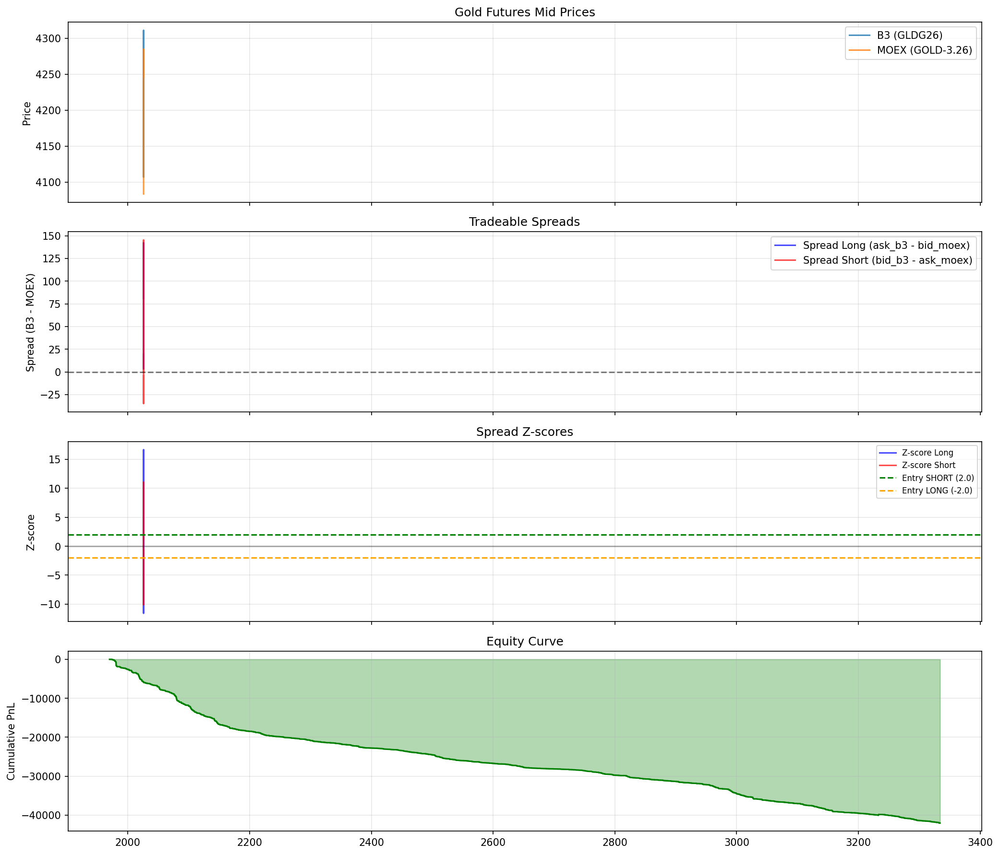

# Gold Arbitrage Backtest Report

Generated: 2026-02-01 00:11:28

## Strategy Parameters

- Entry threshold: 2.0 σ
- Exit threshold: 0.5 σ
- Stop loss: 4.0 σ
- Z-score window: 1000 ticks
- Commission: 0.10 BRL/contract

## Data Summary

- Total rows: 498,188
- Date range: 2025-11-24 12:09:59.834995968 to 2025-12-09 17:46:50.949750016
- B3 avg spread: 26.34
- MOEX avg spread: 2.22

## Results

| Metric | Value |
|--------|-------|
| Number of trades | 1590 |
| Win rate | 0.9% |
| Total PnL | -41416.35 |
| Total commission | 636.00 |
| Net PnL | -42052.35 |
| Avg trade PnL | -26.45 |
| Max drawdown | 42052.35 |
| Sharpe ratio | -20.84 |
| Profit factor | 0.00 |
| Margin per trade | $517 |
| ROI on margin | -8133.9% |

## Charts

