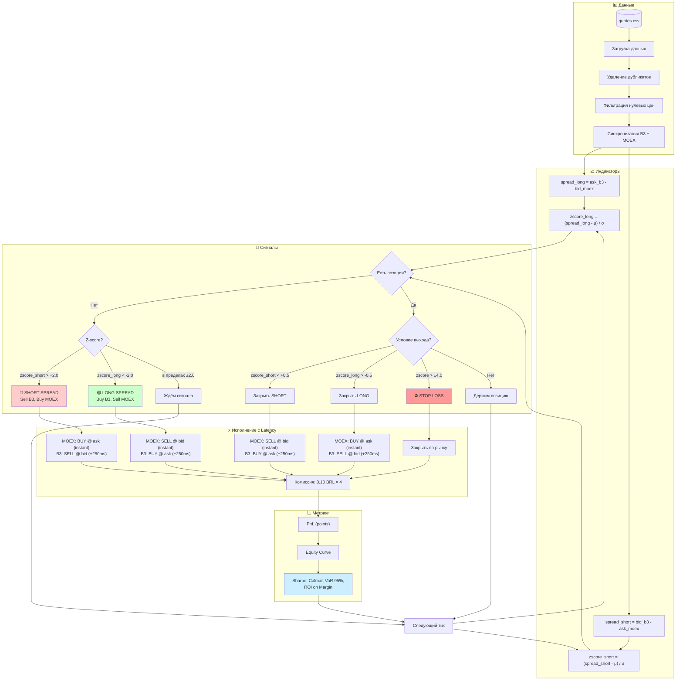
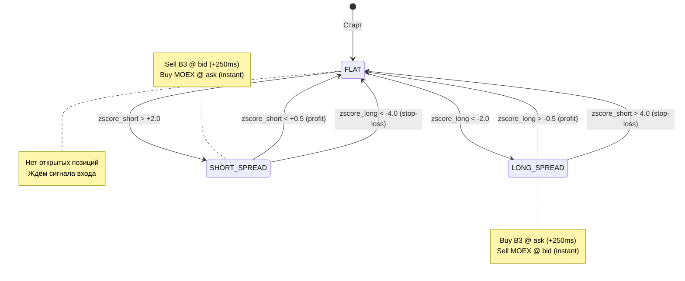
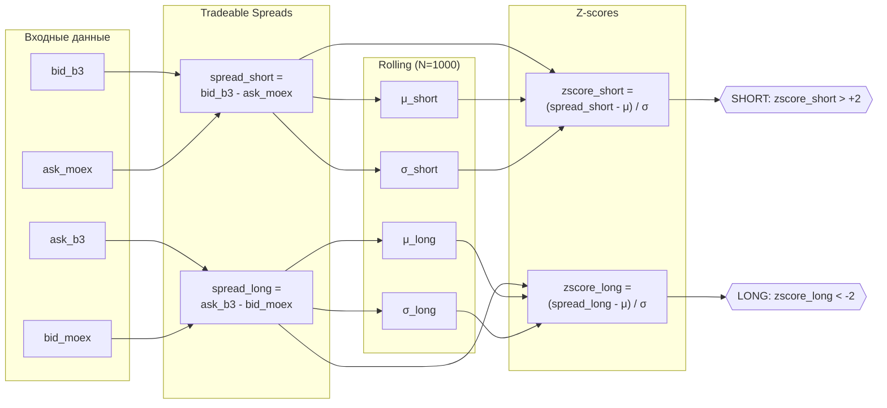

# Арбитражная стратегия: Gold B3 ↔ MOEX

## 1. Executive Summary

Стратегия статистического арбитража между фьючерсами на золото на биржах B3 (Бразилия) и MOEX (Россия). Эксплуатирует временные расхождения цен одного базового актива на разных рынках.

**Тип стратегии:** Market-neutral pairs trading
**Инструменты:** GLDG26 (B3) ↔ GOLD-3.26 (MOEX)
**Горизонт:** Внутридневной (intraday)

---

## 2. Интуитивное объяснение стратегии (High-level overview)

### 2.1 Общая идея

Стратегия относится к классу статистического арбитража. Её цель — зарабатывать не на направлении цены золота, а на временных расхождениях цен одного и того же базового актива, торгующегося на разных биржах.

Мы исходим из предположения, что такие расхождения носят временный характер и со временем возвращаются к своему типичному уровню.

### 2.2 Что на входе

На вход стратегия получает котировки фьючерсов на золото с двух бирж:
- **B3** (Бразилия) — GLDG26
- **MOEX** (Россия) — GOLD-3.26

Для каждого инструмента доступны лучшие цены покупки и продажи (best bid / best ask), обновляющиеся во времени.

### 2.3 Как анализируется цена

**Важно:** Стратегия использует реальные торгуемые цены (bid/ask), а не теоретические mid-price, поскольку по mid-ценам реально исполнить сделку невозможно.

Рассчитываются два спреда — для каждого направления сделки:
- **spread_long** = ask_b3 − bid_moex (цена покупки спреда)
- **spread_short** = bid_b3 − ask_moex (цена продажи спреда)

Чтобы понять, является ли текущее расхождение значимым или обычным рыночным шумом, каждый спред сравнивается со своим историческим поведением за недавний период (1000 тиков).

Это делается путём нормализации — измерения отклонения от среднего в единицах стандартного отклонения (Z-score). Таким образом, стратегия оценивает не абсолютную величину расхождения, а то, насколько оно нетипично по сравнению с недавней историей.

### 2.4 Как принимается торговое решение

Стратегия предполагает, что спред имеет свойство возвращаться к своему среднему значению (mean-reversion):

- Если **zscore_short > +2σ** (спред для продажи выше нормы — B3 относительно дороже), ожидается сужение спреда. Открывается **SHORT** позиция.
- Если **zscore_long < −2σ** (спред для покупки ниже нормы — B3 относительно дешевле), ожидается расширение спреда. Открывается **LONG** позиция.

Сделки открываются только при достаточно сильных отклонениях (±2σ), чтобы потенциальная прибыль превышала торговые издержки.

### 2.5 Типы сделок

Все сделки являются парными: одновременно открываются позиции на обеих биржах в противоположных направлениях.

| Тип | B3 | MOEX | Ставка на |
|-----|-----|------|-----------|
| **LONG spread** | Buy @ ask | Sell @ bid | Рост спреда |
| **SHORT spread** | Sell @ bid | Buy @ ask | Падение спреда |

**Моделирование latency:** MOEX исполняется мгновенно, B3 — с задержкой 250 мс (цена берётся через 250 мс после сигнала).

Благодаря симметричным позициям стратегия в значительной степени нейтральна к общему движению рынка золота. Результат сделки определяется изменением разницы цен между биржами, а не направлением рынка в целом.

### 2.6 Как происходит выход из позиции

Выход из позиции возможен по одному из трёх сценариев:

1. **Достижение цели** — Z-score возвращается близко к нулю (±0.5σ), позиция закрывается с прибылью.
2. **Стоп-лосс** — Z-score продолжает уходить против позиции (> ±4σ), что указывает на повышенный риск. Позиция закрывается для ограничения убытков.
3. **Окончание данных** — все открытые позиции принудительно закрываются.

Такой подход обеспечивает дисциплинированное управление риском и исключает удержание убыточных позиций в ожидании разворота.

---

## 3. Допущения (Assumptions)

| Параметр | Допущение | Комментарий |
|----------|-----------|-------------|
| Базовый актив | Оба фьючерса привязаны к золоту | Разные биржи, но один underlying |
| Валюта расчётов | PnL в пунктах спреда, маржа в USD | Упрощение: игнорируем BRL/RUB конвертацию |
| Данные | Top-of-book (лучший bid/ask) | Структура CSV |
| Дубликаты в данных | Удаляем | Технический артефакт |
| Таймзона | UTC | Стандарт |
| Размер позиции | 1 контракт на каждой ноге | Market-neutral |
| Комиссии | **0.10 BRL за контракт** | Фиксированная комиссия |
| Slippage | Пересечение спреда (cross spread) | Worst-case execution |
| Latency B3 | **250 мс** | MOEX — мгновенно |
| ГО (маржа) | B3: $217, MOEX: $300 | Итого $517 на сделку |
| Время удержания | Без ограничений | Держим до сигнала выхода |
| Margin call | Не моделируется | Только initial margin check |

---

## 4. Описание данных

**Файл:** `quotes_202512260854-GOLD.csv`

| Поле | Описание |
|------|----------|
| `ts` | Timestamp (наносекунды) |
| `symbol` | `GLDG26` (B3) или `GOLD-3.26` (MOEX) |
| `bid_price` | Лучшая цена покупки |
| `bid_qty` | Объём на лучшем bid |
| `ask_price` | Лучшая цена продажи |
| `ask_qty` | Объём на лучшем ask |

**Предобработка:**
1. Удаление дубликатов
2. Фильтрация нулевых цен (bid=0 или ask=0)
3. Синхронизация по времени (forward-fill для выравнивания)

---

## 5. Логика стратегии

### 5.1 Расчёт спреда (по tradeable ценам)

**Важно:** Используем bid/ask цены, а не mid — по mid-ценам реально купить невозможно.

```python
# Для LONG спреда (покупаем B3, продаём MOEX):
spread_long = ask_b3 - bid_moex

# Для SHORT спреда (продаём B3, покупаем MOEX):
spread_short = bid_b3 - ask_moex
```

Каждое направление имеет свой Z-score: `zscore_long` и `zscore_short`.

### 5.2 Нормализация спреда (Z-score)

```python
zscore_long = (spread_long - rolling_mean(spread_long, N)) / rolling_std(spread_long, N)
zscore_short = (spread_short - rolling_mean(spread_short, N)) / rolling_std(spread_short, N)
```

Где `N = 1000` тиков — окно расчёта.

### 5.3 Торговые сигналы

| Условие | Действие |
|---------|----------|
| `zscore_short > +2.0` | **SHORT SPREAD**: Sell B3 @ bid, Buy MOEX @ ask |
| `zscore_long < -2.0` | **LONG SPREAD**: Buy B3 @ ask, Sell MOEX @ bid |
| `zscore_long > -0.5` (для LONG) | **Закрыть LONG** (спред вернулся к среднему) |
| `zscore_short < +0.5` (для SHORT) | **Закрыть SHORT** (спред вернулся к среднему) |
| `abs(zscore) > 4.0` | **Stop-loss** |

**Параметры по умолчанию:**
- `entry_threshold = 2.0` σ
- `exit_threshold = 0.5` σ
- `stop_loss_threshold = 4.0` σ
- `zscore_window = 1000` тиков

---

## 6. Сигналы входа и выхода

### Вход в позицию

```
IF no_position AND z_score > +2.0:
    SELL 1 GLDG26 @ ask_b3      # Продаём B3
    BUY  1 GOLD-3.26 @ ask_moex # Покупаем MOEX
    position = SHORT_SPREAD

IF no_position AND z_score < -2.0:
    BUY  1 GLDG26 @ ask_b3      # Покупаем B3
    SELL 1 GOLD-3.26 @ bid_moex # Продаём MOEX
    position = LONG_SPREAD
```

### Выход из позиции

```
IF position == SHORT_SPREAD AND z_score < +0.5:
    BUY  1 GLDG26 @ ask_b3      # Закрываем short B3
    SELL 1 GOLD-3.26 @ bid_moex # Закрываем long MOEX
    position = NONE

IF position == LONG_SPREAD AND z_score > -0.5:
    SELL 1 GLDG26 @ bid_b3      # Закрываем long B3
    BUY  1 GOLD-3.26 @ ask_moex # Закрываем short MOEX
    position = NONE
```

### Stop-loss

```
IF abs(z_score) > 4.0:
    CLOSE position immediately  # Спред ушёл слишком далеко
```

---

## 7. Risk Management

### 7.1 Позиционные лимиты

| Параметр | Значение |
|----------|----------|
| Max позиция на инструмент | 1 контракт |
| Max открытых сделок | 1 |
| Max убыток на сделку | 2% от капитала |
| Max дневной убыток | 5% от капитала |

### 7.2 Условия торговли

- **Ликвидность:** `bid_qty >= 1 AND ask_qty >= 1` на обоих инструментах
- **Спред:** `ask - bid < max_spread_threshold` (фильтр широкого спреда)
- **Время:** Только в пересечение торговых сессий B3 и MOEX

### 7.3 Риски стратегии

| Риск | Описание | Митигация |
|------|----------|-----------|
| Execution risk | Невозможность исполнить обе ноги одновременно | Лимитные ордера, проверка ликвидности |
| Model risk | Спред не возвращается к среднему | Stop-loss на 4σ |
| Liquidity risk | Недостаточная ликвидность | Фильтр по qty |
| Currency risk | Движение BRL/RUB | В данной версии игнорируется |
| Latency risk | Задержка между биржами | **Смоделировано**: B3 = 250 мс, MOEX = 0 мс |

---

## 8. Ожидаемые метрики

Для бэктеста на исторических данных планируется рассчитать:

| Метрика | Описание |
|---------|----------|
| **Total PnL** | Общая прибыль/убыток |
| **Number of trades** | Количество сделок |
| **Win rate** | % прибыльных сделок |
| **Average trade** | Средний PnL на сделку |
| **Sharpe Ratio** | Risk-adjusted return (annualized) |
| **Max Drawdown** | Максимальная просадка |
| **Profit Factor** | Gross profit / Gross loss |
| **Calmar Ratio** | Annualized return / Max Drawdown |
| **VaR 95%** | 5-й перцентиль PnL по сделкам |
| **ROI on Margin** | Net PnL / Margin * 100% |

---

## 9. Ограничения и следующие шаги

### Текущие ограничения

1. **Упрощённая модель валют** — не учитываем реальную конвертацию BRL/RUB/USD
2. **Размер контракта** — не учтён реальный notional value
3. **Margin call** — не моделируется (только initial margin check)

### Выполненные шаги

1. [x] Загрузка и очистка данных из CSV
2. [x] Расчёт спреда по tradeable ценам (bid/ask)
3. [x] Dual Z-score (zscore_long, zscore_short)
4. [x] Реализация бэктеста с latency (B3: 250 мс)
5. [x] Фиксированная комиссия (0.10 BRL/контракт)
6. [x] Моделирование маржи (ГО): B3 $217 + MOEX $300
7. [x] Метрики: Calmar, VaR 95%, ROI on margin
8. [x] Визуализация (Plotly dashboards)

### Следующие шаги

1. [ ] Оптимизация параметров (threshold, window)
2. [ ] Анализ чувствительности к комиссиям
3. [ ] Фильтр по ширине спреда B3

---

## 10. Реализация (Python)

### 10.1 Структура проекта

```
task3-gold-arbitrage/
├── config.py              # Параметры стратегии (~50 LOC)
├── main.py                # Основной скрипт (~300 LOC)
├── requirements.txt       # Зависимости
├── src/
│   ├── __init__.py
│   ├── data_loader.py     # Загрузка CSV (~90 LOC)
│   ├── indicators.py      # Z-score (~50 LOC)
│   └── backtest.py        # Движок бэктеста (~200 LOC)
├── output/
│   ├── backtest_report.md # Отчёт
│   ├── backtest_results.png # Графики
│   └── trades.csv         # Список сделок
└── strategy.md            # Документация
```

### 10.2 Запуск

```bash
cd task3-gold-arbitrage
python3 -m venv .venv
source .venv/bin/activate
pip install -r requirements.txt
python main.py
```

### 10.3 Модули

#### config.py
Dataclass-конфигурация с параметрами стратегии:
- `entry_threshold`, `exit_threshold`, `stop_loss_threshold` — пороги Z-score
- `zscore_window` — окно расчёта
- `commission_per_contract` — комиссия (0.10 BRL)
- `b3_latency_ms` — задержка исполнения B3 (250 мс)
- `margin_b3`, `margin_moex` — маржинальные требования в USD
- `symbol_b3`, `symbol_moex` — тикеры инструментов

#### src/data_loader.py
- `load_quotes()` — загрузка CSV, очистка заголовков, удаление дубликатов
- `prepare_synchronized_data()` — объединение данных B3 и MOEX по времени с forward-fill
- `get_data_summary()` — статистика по данным

#### src/indicators.py
- `calculate_tradeable_spreads()` — spread_long и spread_short по bid/ask
- `calculate_zscore_dual()` — rolling Z-score для обоих направлений
- `add_indicators()` — добавление всех индикаторов в DataFrame

#### src/backtest.py
- `Backtest` класс — движок симуляции с поддержкой:
  - Открытие/закрытие позиций по сигналам
  - **Latency моделирование**: MOEX мгновенно, B3 через 250 мс
  - Фиксированная комиссия (0.10 BRL/контракт)
  - Stop-loss на 4σ
  - Проверка ликвидности
- `BacktestResult` — метрики (PnL, Sharpe, Calmar, VaR, ROI on margin)
- `Trade`, `Position` — структуры данных

#### src/visualization.py
- `plot_equity_plotly()` — интерактивная кривая капитала
- `plot_strategy_dashboard()` — комплексный дашборд (цены, спреды, Z-score, equity)

#### main.py
- Загрузка данных
- Расчёт индикаторов
- Запуск бэктеста
- Генерация отчётов и графиков

---

## 11. Результаты бэктеста

### 11.1 Параметры

| Параметр | Значение |
|----------|----------|
| Entry threshold | 2.0 σ |
| Exit threshold | 0.5 σ |
| Stop loss | 4.0 σ |
| Z-score window | 1000 ticks |
| Commission | **0.10 BRL/контракт** |
| B3 latency | **250 мс** |
| Margin B3 | **$217** (~1,300 BRL) |
| Margin MOEX | **$300** (~30,000 ₽) |

### 11.2 Данные

| Метрика | Значение |
|---------|----------|
| Период | 2025-11-24 — 2025-12-09 |
| Всего строк | 498,188 |
| B3 avg spread | **26.34** пунктов |
| MOEX avg spread | **2.22** пункта |

### 11.3 Результаты (с учётом latency и маржи)

| Метрика | Значение |
|---------|----------|
| Количество сделок | 1,590 |
| Win rate | 0.9% |
| Total PnL | -41,416 |
| Total commission | 636 |
| **Net PnL** | **-42,052** |
| Max drawdown | 42,052 |
| Sharpe ratio | -20.84 |
| Profit factor | 0.00 |
| Calmar ratio | -0.50 |
| VaR 95% | -75 |
| Margin per trade | **$517** |
| **ROI on margin** | **-8,134%** |

### 11.4 Анализ результатов

**Стратегия убыточна.** Ниже — разбор корневых причин и ответ на вопрос "что делать".

#### Корневая причина: bid-ask spread B3 съедает весь edge

Спред на B3 составляет в среднем **~26 пунктов**, на MOEX — **~2 пункта**. При каждой сделке мы пересекаем спред дважды (вход + выход), что даёт неизбежные потери:

```
Потери на вход:  spread_b3 / 2 + spread_moex / 2 ≈ 13 + 1 = 14 пт
Потери на выход: spread_b3 / 2 + spread_moex / 2 ≈ 13 + 1 = 14 пт
─────────────────────────────────────────────────────────────────
Итого на round-trip:                                    ≈ 28 пт
```

Средний PnL на сделку: **-26.45 пунктов** — практически равен стоимости crossing spread. Это означает, что mean-reversion сигнал работает (иначе убыток был бы значительно больше), но прибыль от возврата спреда к среднему **полностью поглощается транзакционными издержками**.

#### Является ли спред mean-reverting?

На имеющихся данных (34 минуты, ~500K тиков) стратегия совершила 1,590 сделок, win rate 0.9%. Это не означает что mean-reversion не работает — это означает что **амплитуда возврата меньше стоимости входа/выхода**.

Для прибыльности стратегии при текущих параметрах необходимо, чтобы средний цикл возврата Z-score приносил > 28 пт. На данных это не наблюдается.

Дополнительная проблема: 34 минуты — слишком короткий горизонт для статистически значимой оценки mean-reversion. Нужны данные за несколько торговых дней, чтобы увидеть достаточное количество полных циклов.

#### Latency усугубляет проблему

B3 исполняется с задержкой 250 мс. За это время цена может сдвинуться, что добавляет дополнительный slippage сверх bid-ask spread. На волатильном рынке это превращает каждый вход в лотерею.

#### Что бы я сделал иначе

1. **Перейти на лимитные ордера на B3** — вместо crossing spread (~26 пт потерь) выставлять limit order внутри спреда. Подробнее — раздел 11.5.
2. **Торговать MOEX, используя B3 как сигнал** — ликвидность MOEX позволяет входить/выходить с минимальными потерями (~2 пт). B3 используется только для генерации сигналов, но не для исполнения.
3. **Увеличить порог входа до 3-4σ** — входить только при экстремальных отклонениях, когда потенциальная прибыль от возврата перекрывает транзакционные издержки.
4. **Фильтр по ширине спреда B3** — не торговать когда spread_b3 > threshold (например, > 15 пт). Торговать только в моменты высокой ликвидности B3.
5. **Получить больше данных** — 34 минуты недостаточно для оценки стратегии. На нескольких днях картина может быть иной.

### 11.5 Альтернативная стратегия: лимитные ордера на B3

Реализовано в отдельных файлах (`src/backtest_limit.py`, `main_limit.py`), оригинал не затронут.

#### Идея

Вместо пересечения спреда на B3 (market order) — выставлять **limit order по mid-price**. MOEX исполняется market order **в момент fill B3** (не в момент сигнала).

```
Market order (текущее):
  BUY B3 @ ask = 4311    (теряем ~13 пт на crossing)

Limit order (новое):
  BUY B3 @ mid = 4298    (теряем ~0 пт, но ждём fill)
```

#### Модель fill ("Price Touch")

Limit BUY @ P считается исполненным когда:
1. Прошло ≥ 250 мс (latency) с момента размещения
2. `ask_b3 ≤ P` на любом тике в пределах timeout (5 сек)
3. `ask_qty_b3 ≥ position_size`

**Ограничения:** Не учитывает queue position и adverse selection (оптимистичная модель).

#### Результаты: Market vs Limit Orders

| Метрика | Market Orders | Limit Orders | Изменение |
|---------|--------------|-------------|-----------|
| Сделок | 1,590 | 17 | -99% |
| Net PnL | -42,052 | **-40.63** | -99.9% убытка |
| Avg PnL/сделку | -26.45 | **-2.39** | улучшение 11x |
| Win rate | 0.9% | **17.6%** | +17 п.п. |
| Sharpe | -20.84 | -11.16 | лучше |
| ROI on margin | -8,134% | **-7.9%** | ~0% |
| Fill rate | 100% | **0.02%** | критически низкий |
| Avg fill time | 250 мс | 3,209 мс | — |

#### Выводы

**Экономика каждой сделки улучшилась в 11 раз** — потери на сделку снизились с 26.45 до 2.39 пт. Это подтверждает, что основная проблема market orders — стоимость crossing spread, а не качество сигнала.

**Но fill rate 0.02% делает стратегию неторгуемой.** Mid-price B3 при спреде ~26 пт почти никогда не достигается. Из 140,055 попыток только 33 были заполнены.

Это подтверждает фундаментальный тезис: **B3 gold futures слишком неликвидны для арбитража с MOEX** — ни market orders (слишком дорого), ни limit orders (не исполняются).

#### Риски лимитных ордеров

1. **Fill rate** — на данных 0.02%, в реальности может быть ещё ниже
2. **Adverse selection** — fill происходит когда цена движется против нас
3. **Timing risk** — MOEX цена уходит пока ждём fill на B3
4. **Partial fills** — незахеджированная позиция
5. **Latency 250 мс** — ордер выставляется по устаревшей цене

#### Запуск

```bash
python main_limit.py  # Сравнение market vs limit
python main.py        # Оригинальный бэктест (без изменений)
```

### 11.6 Другие рекомендации по улучшению

1. **Фильтр по спреду B3** — торговать только когда spread_b3 < threshold (например, < 15 пт)
2. **Увеличить порог входа** — entry_threshold = 3.0-4.0σ, чтобы edge перекрывал издержки
3. **Оптимизация окна** — подобрать zscore_window под характерное время mean-reversion
4. **Торговать только MOEX** — использовать B3 как сигнальный источник, исполняться только на MOEX (спред 2 пт)
5. **Больше данных** — текущие 34 минуты недостаточны для статистически значимой оценки

---

## Приложение A: Диаграмма логики стратегии



### Диаграмма состояний позиции



### Схема расчёта двойных спредов и Z-score



---

## Приложение B: Формулы

### Z-score
$$z = \frac{x - \mu}{\sigma}$$

### Sharpe Ratio
$$SR = \frac{E[R] - R_f}{\sigma_R} \times \sqrt{252}$$

### Maximum Drawdown
$$MDD = \max_{t} \left( \frac{\max_{s \leq t} P_s - P_t}{\max_{s \leq t} P_s} \right)$$
