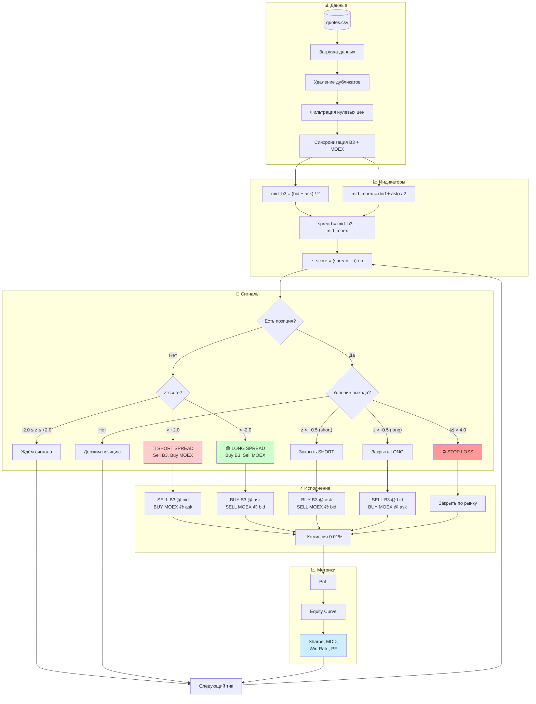
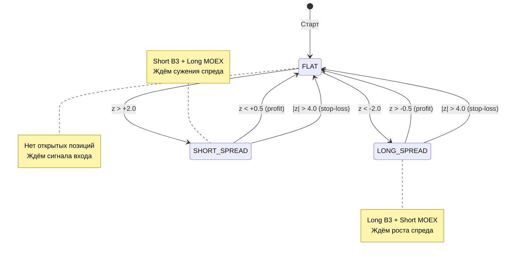
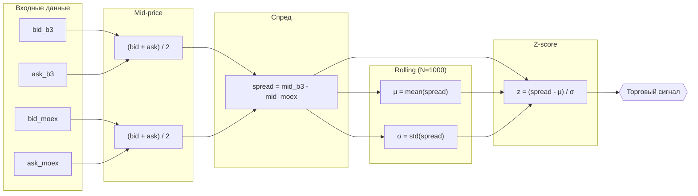

# Арбитражная стратегия: Gold B3 ↔ MOEX

## 1. Executive Summary

Стратегия статистического арбитража между фьючерсами на золото на биржах B3 (Бразилия) и MOEX (Россия). Эксплуатирует временные расхождения цен одного базового актива на разных рынках.

**Тип стратегии:** Market-neutral pairs trading
**Инструменты:** GLDG26 (B3) ↔ GOLD-3.26 (MOEX)
**Горизонт:** Внутридневной (intraday)

---

## 2. Допущения (Assumptions)

| Параметр | Допущение | Комментарий |
|----------|-----------|-------------|
| Базовый актив | Оба фьючерса привязаны к золоту | Разные биржи, но один underlying |
| Валюта расчётов | USD-эквивалент | Упрощение: игнорируем BRL/RUB конвертацию |
| Данные | Top-of-book (лучший bid/ask) | Структура CSV |
| Дубликаты в данных | Удаляем | Технический артефакт |
| Таймзона | UTC | Стандарт |
| Размер позиции | 1 контракт на каждой ноге | Для демонстрации |
| Комиссии | 0.01% от notional на каждую сделку | Консервативная оценка |
| Slippage | Пересечение спреда (cross spread) | Worst-case execution |

---

## 3. Описание данных

**Файл:** `quotes_202512260854-GOLD.csv`

| Поле | Описание |
|------|----------|
| `ts` | Timestamp (наносекунды) |
| `symbol` | `GLDG26` (B3) или `GOLD-3.26` (MOEX) |
| `bid_price` | Лучшая цена покупки |
| `bid_qty` | Объём на лучшем bid |
| `ask_price` | Лучшая цена продажи |
| `ask_qty` | Объём на лучшем ask |

**Предобработка:**
1. Удаление дубликатов
2. Фильтрация нулевых цен (bid=0 или ask=0)
3. Синхронизация по времени (forward-fill для выравнивания)

---

## 4. Логика стратегии

### 4.1 Расчёт спреда

```
mid_b3 = (bid_b3 + ask_b3) / 2
mid_moex = (bid_moex + ask_moex) / 2

spread = mid_b3 - mid_moex
```

### 4.2 Нормализация спреда (Z-score)

```
z_score = (spread - rolling_mean(spread, N)) / rolling_std(spread, N)
```

Где `N` — окно расчёта (например, 1000 тиков или 5 минут).

### 4.3 Торговые сигналы

| Условие | Действие |
|---------|----------|
| `z_score > +threshold` | **SELL B3, BUY MOEX** (спред расширился, ждём сужения) |
| `z_score < -threshold` | **BUY B3, SELL MOEX** (спред сузился, ждём расширения) |
| `abs(z_score) < exit_threshold` | **Закрыть позицию** (спред вернулся к среднему) |

**Параметры по умолчанию:**
- `threshold = 2.0` (2 стандартных отклонения)
- `exit_threshold = 0.5`
- `N = 1000` тиков

---

## 5. Сигналы входа и выхода

### Вход в позицию

```
IF no_position AND z_score > +2.0:
    SELL 1 GLDG26 @ ask_b3      # Продаём B3
    BUY  1 GOLD-3.26 @ ask_moex # Покупаем MOEX
    position = SHORT_SPREAD

IF no_position AND z_score < -2.0:
    BUY  1 GLDG26 @ ask_b3      # Покупаем B3
    SELL 1 GOLD-3.26 @ bid_moex # Продаём MOEX
    position = LONG_SPREAD
```

### Выход из позиции

```
IF position == SHORT_SPREAD AND z_score < +0.5:
    BUY  1 GLDG26 @ ask_b3      # Закрываем short B3
    SELL 1 GOLD-3.26 @ bid_moex # Закрываем long MOEX
    position = NONE

IF position == LONG_SPREAD AND z_score > -0.5:
    SELL 1 GLDG26 @ bid_b3      # Закрываем long B3
    BUY  1 GOLD-3.26 @ ask_moex # Закрываем short MOEX
    position = NONE
```

### Stop-loss

```
IF abs(z_score) > 4.0:
    CLOSE position immediately  # Спред ушёл слишком далеко
```

---

## 6. Risk Management

### 6.1 Позиционные лимиты

| Параметр | Значение |
|----------|----------|
| Max позиция на инструмент | 1 контракт |
| Max открытых сделок | 1 |
| Max убыток на сделку | 2% от капитала |
| Max дневной убыток | 5% от капитала |

### 6.2 Условия торговли

- **Ликвидность:** `bid_qty >= 1 AND ask_qty >= 1` на обоих инструментах
- **Спред:** `ask - bid < max_spread_threshold` (фильтр широкого спреда)
- **Время:** Только в пересечение торговых сессий B3 и MOEX

### 6.3 Риски стратегии

| Риск | Описание | Митигация |
|------|----------|-----------|
| Execution risk | Невозможность исполнить обе ноги одновременно | Лимитные ордера, проверка ликвидности |
| Model risk | Спред не возвращается к среднему | Stop-loss на 4σ |
| Liquidity risk | Недостаточная ликвидность | Фильтр по qty |
| Currency risk | Движение BRL/RUB | В данной версии игнорируется |
| Latency risk | Задержка между биржами | Учитывать в реальной торговле |

---

## 7. Ожидаемые метрики

Для бэктеста на исторических данных планируется рассчитать:

| Метрика | Описание |
|---------|----------|
| **Total PnL** | Общая прибыль/убыток |
| **Number of trades** | Количество сделок |
| **Win rate** | % прибыльных сделок |
| **Average trade** | Средний PnL на сделку |
| **Sharpe Ratio** | Risk-adjusted return (annualized) |
| **Max Drawdown** | Максимальная просадка |
| **Profit Factor** | Gross profit / Gross loss |

---

## 8. Ограничения и следующие шаги

### Текущие ограничения

1. **Упрощённая модель валют** — не учитываем реальную конвертацию BRL/RUB/USD
2. **Синхронизация данных** — предполагаем мгновенное исполнение
3. **Размер контракта** — не учтён реальный notional value
4. **Маржинальные требования** — не смоделированы

### Следующие шаги

1. [x] Загрузка и очистка данных из CSV
2. [x] Расчёт спреда и z-score
3. [x] Реализация бэктеста
4. [x] Визуализация результатов
5. [ ] Оптимизация параметров (threshold, window)
6. [ ] Анализ чувствительности к комиссиям

---

## 9. Реализация (Python)

### 9.1 Структура проекта

```
task3-gold-arbitrage/
├── config.py              # Параметры стратегии (~50 LOC)
├── main.py                # Основной скрипт (~300 LOC)
├── requirements.txt       # Зависимости
├── src/
│   ├── __init__.py
│   ├── data_loader.py     # Загрузка CSV (~90 LOC)
│   ├── indicators.py      # Z-score (~50 LOC)
│   └── backtest.py        # Движок бэктеста (~200 LOC)
├── output/
│   ├── backtest_report.md # Отчёт
│   ├── backtest_results.png # Графики
│   └── trades.csv         # Список сделок
└── strategy.md            # Документация
```

### 9.2 Запуск

```bash
cd task3-gold-arbitrage
python3 -m venv .venv
source .venv/bin/activate
pip install -r requirements.txt
python main.py
```

### 9.3 Модули

#### config.py
Dataclass-конфигурация с параметрами стратегии:
- `entry_threshold`, `exit_threshold`, `stop_loss_threshold` — пороги Z-score
- `zscore_window` — окно расчёта
- `commission_pct` — комиссия
- `symbol_b3`, `symbol_moex` — тикеры инструментов

#### src/data_loader.py
- `load_quotes()` — загрузка CSV, очистка заголовков, удаление дубликатов
- `prepare_synchronized_data()` — объединение данных B3 и MOEX по времени с forward-fill
- `get_data_summary()` — статистика по данным

#### src/indicators.py
- `calculate_spread()` — разница mid-price B3 и MOEX
- `calculate_zscore()` — rolling Z-score с заданным окном

#### src/backtest.py
- `Backtest` класс — движок симуляции с поддержкой:
  - Открытие/закрытие позиций по сигналам
  - Учёт комиссий
  - Stop-loss
  - Проверка ликвидности
- `BacktestResult` — метрики (PnL, Sharpe, drawdown, profit factor)
- `Trade`, `Position` — структуры данных

#### main.py
- Загрузка данных
- Расчёт индикаторов
- Запуск бэктеста
- Генерация отчётов и графиков

---

## 10. Результаты бэктеста

### 10.1 Параметры

| Параметр | Значение |
|----------|----------|
| Entry threshold | 2.0 σ |
| Exit threshold | 0.5 σ |
| Stop loss | 4.0 σ |
| Z-score window | 1000 ticks |
| Commission | 0.01% |

### 10.2 Данные

| Метрика | Значение |
|---------|----------|
| Период | 2025-11-24 — 2025-12-09 |
| Всего строк | 498,188 |
| B3 avg spread | **26.34** |
| MOEX avg spread | **2.22** |

### 10.3 Результаты

| Метрика | Значение |
|---------|----------|
| Количество сделок | 2,860 |
| Win rate | 1.3% |
| Total PnL | -77,523 |
| Total commission | 4,834 |
| **Net PnL** | **-82,357** |
| Max drawdown | 82,357 |
| Sharpe ratio | -21.30 |
| Profit factor | 0.00 |

### 10.4 Анализ результатов

**Стратегия убыточна.** Основные причины:

1. **Огромный спред на B3** (~26 пунктов vs ~2 на MOEX)
   - При каждой сделке теряем ~24 пункта на входе/выходе
   - Mean-reversion не компенсирует эти потери

2. **Асимметрия ликвидности**
   - MOEX: узкий спред, высокая ликвидность
   - B3: широкий спред, низкая ликвидность
   - Арбитраж работает только при сопоставимой ликвидности

3. **Высокая частота сделок**
   - 2,860 сделок за ~2 недели
   - Каждая сделка несёт издержки на спред

### 10.5 Рекомендации по улучшению

1. **Фильтр по спреду B3** — торговать только когда spread_b3 < threshold
2. **Увеличить порог входа** — entry_threshold = 3.0-4.0 σ
3. **Использовать лимитные ордера** вместо market orders
4. **Оптимизация окна** — подобрать zscore_window
5. **Альтернативная стратегия** — торговать только MOEX, используя B3 как сигнал

---

## Приложение A: Диаграмма логики стратегии



### Диаграмма состояний позиции



### Схема расчёта Z-score



---

## Приложение B: Формулы

### Z-score
$$z = \frac{x - \mu}{\sigma}$$

### Sharpe Ratio
$$SR = \frac{E[R] - R_f}{\sigma_R} \times \sqrt{252}$$

### Maximum Drawdown
$$MDD = \max_{t} \left( \frac{\max_{s \leq t} P_s - P_t}{\max_{s \leq t} P_s} \right)$$
